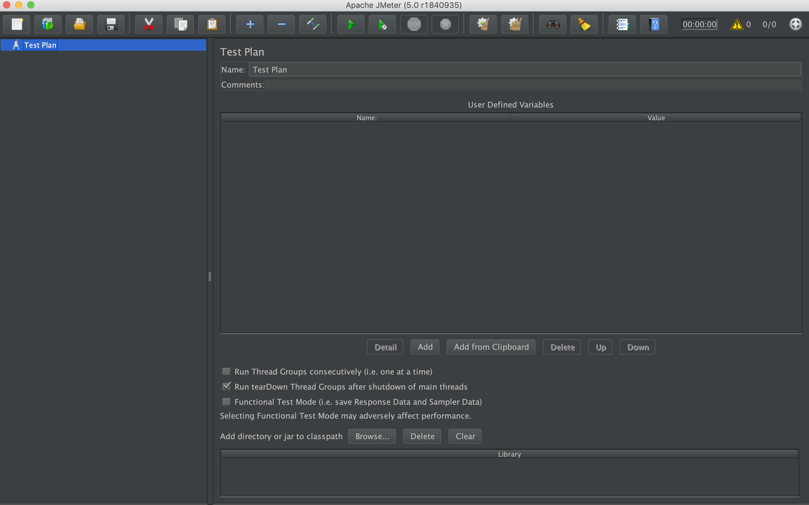

#Testy wydajnościowe

## Jmeter

Download: `https://jmeter.apache.org/download_jmeter.cgi`

rozpakuj i uruchom plik z folderu bin `./jmeter.sh`

powinna uruchomić się aplikacja:

Dokumentacja użytkownika:
``http://jmeter.apache.org/usermanual/get-started.html#options``